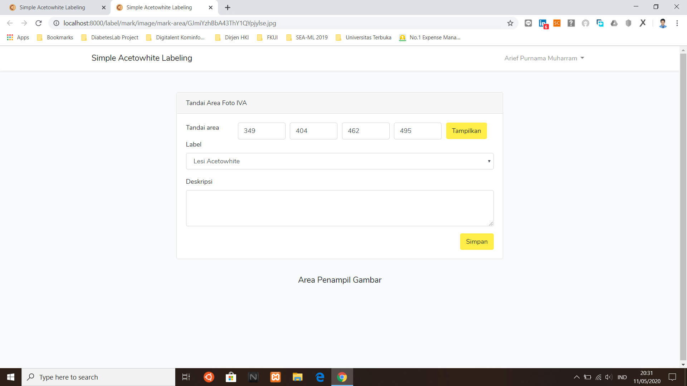
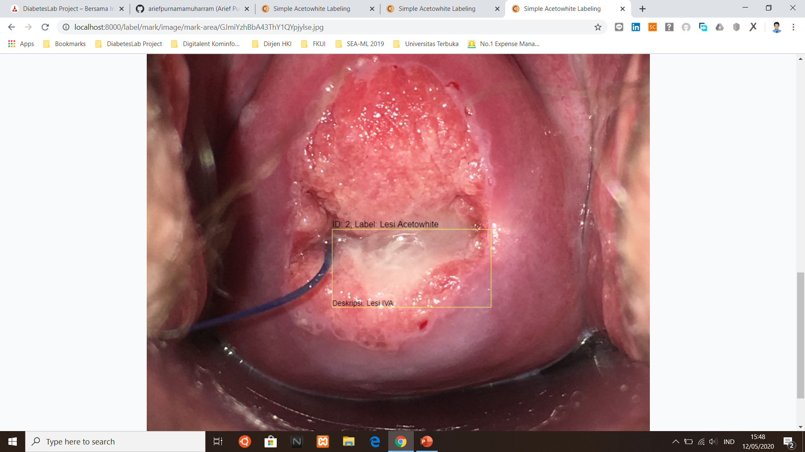
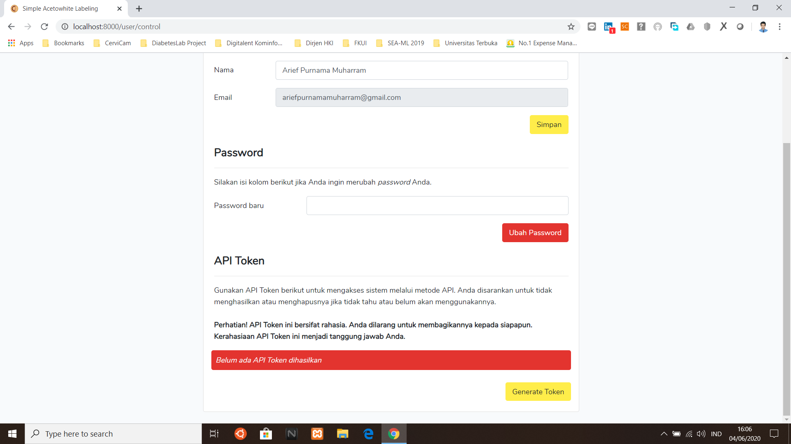
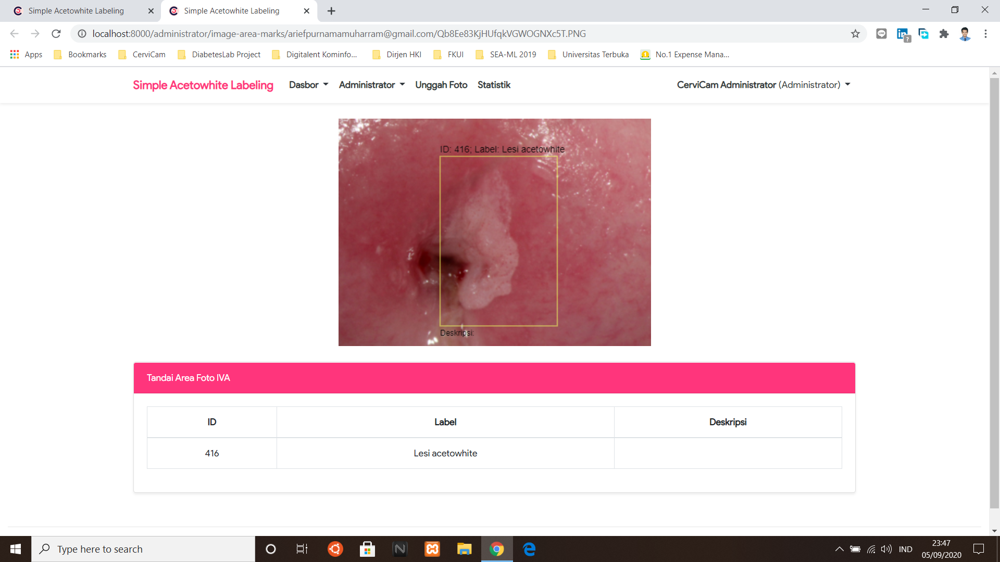

# Simple Acetowhite Labeling Web Application


Repositori ini berisi aplikasi web sederhana untuk membantu melabeli lesi _acetowhite_ pada foto pemeriksaan IVA (inspeksi visual dengan asam asetat) serviks. Aplikasi web ini ini dibangun dengan menggunakan _framework_ Laravel. Kode sumber program ini ditulis oleh **Arief Purnama Muharram**.

## Panduan Instalasi
1. Klon repositori, `git clone https://github.com/ariefpurnamamuharram/Simple-Acetowhite-Labeling-Web-Application.git` atau `https://github.com/CerviCam/Simple-Acetowhite-Labeling-Web-Application.git`.
2. Salin file `.env.example` menjadi `.env`. Rubah pengatauran akses terhadap database Anda.
3. Jalankan instalasi Composer dengan perintah `composer install`.
4. Jalankan perintah `php artisan key:generate`.
5. Jalankan migrasi database dengan perintah `php artisan migrate`.
6. Jalankan database seeder dengan perintah `php artisan db:seed`.
7. Selesai.

## Screenshots
### Version 2020.01








### Version 2020.02




## Daftar Akses API
### Version 2020.01

- Download koleksi foto IVA positif
```
curl \
    -X GET \
    -H "Accept: application/json" \
    -H "Authorization: Bearer XXX" \
    http://localhost/api/download-iva-positive \
    --output file.zip
```
Ganti `XXX` dengan API Token Anda.

- Download koleksi foto IVA negatif
```
curl \
    -X GET \
    -H "Accept: application/json" \
    -H "Authorization: Bearer XXX" \
    http://localhost/api/download-iva-negative \
    --output file.zip
```
Ganti `XXX` dengan API Token Anda.

### Version 2020.02 and later...

- Download koleksi foto IVA positif
```
curl \
    -X GET \
    -H "Accept: application/json" \
    -H "Authorization: Bearer XXX" \
    http://localhost/api/download-positives \
    --output file.zip
```
Ganti `XXX` dengan API Token Anda.

- Download koleksi foto IVA negatif
```
curl \
    -X GET \
    -H "Accept: application/json" \
    -H "Authorization: Bearer XXX" \
    http://localhost/api/download-negatives \
    --output file.zip
```
Ganti `XXX` dengan API Token Anda.

## Hak Cipta
Hak cipta aplikasi ini dimiliki penuh oleh **Cervicam Research Group**. Anda bebas menggunakan aplikasi ini selama untuk tujuan nonkomersil. 

## Lain-lain
Sistem ini telah dipresentasikan pada konferensi ilmiah The International Congress of Asia Oceania Research Organization on Genital Infections and Neoplasia (AOGIN) 2021. Informasi lebih lengkap mengenai penelitian tersebut dapat diakses melalui https://www.researchgate.net/publication/350783419_The_Simple_Acetowhite_Labeling_System_For_Artificial_Intelligence_Dataset_Preparation

## Kontributor
Tim riset CerviCam:
1. Dr. dr. Hariyono Winarto, Sp.OG(K)Onk.
2. dr. Anindya Pradipta Susanto, B.Eng., MM.
3. Ucca Ratulangi Widitha, S.Ked., B.Med.Sci(Hons).
4. Alessa Fahira, S.Ked.
5. Arief Purnama Muharram, S.Ked.
6. Harits Abdurrahman, S.Kom.

